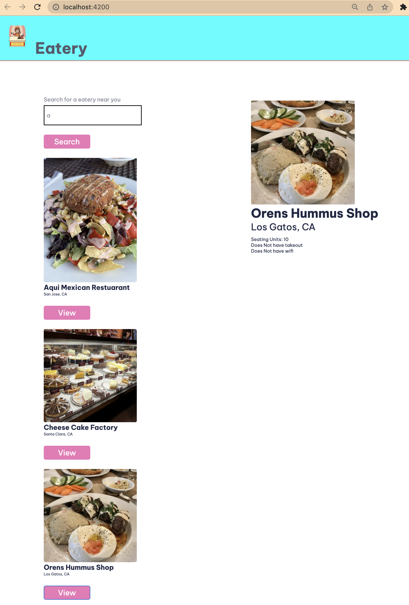

# Introduction to Angular Codelab

In this codelab, you'll build a eatery app with Angular. This is the completed app and features the ability to view home listings based on user search, and view details of a eatery location.

You'll build everything with Angular using Angular's powerful tooling and great browser integration.

## [Codelab link](https://sdkdeepa-angular-nation-codelab.netlify.app/)

Here's a preview of the application:

